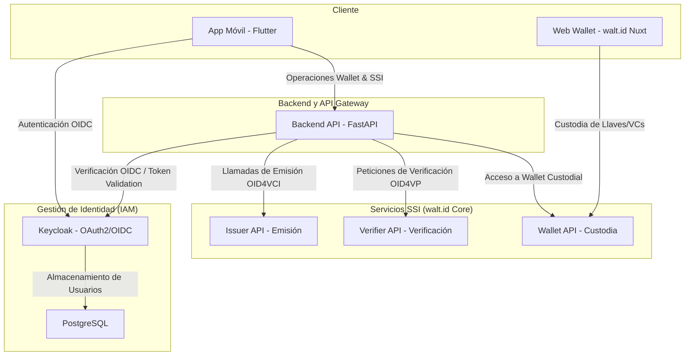

# VC-Wallet Platform 👛🔐 v0.2.7

[](https://docs.docker.com/)
[](https://fastapi.tiangolo.com/)
[](https://flutter.dev/)
[](https://www.keycloak.org/)
[](https://walt.id/)

Este repositorio contiene la plataforma integrada **VC-Wallet**, un ecosistema para la gestión de **Credenciales Verificables (Verifiable Credentials - VCs)** y autenticación mediante Identidad Descentralizada (SSI). El proyecto está diseñado como un monorepo que integra un backend de control, servicios SSI descentralizados, un gestor de identidad (IAM) y una aplicación móvil multiplataforma.

---

## Arquitectura del Sistema

El ecosistema está compuesto por los siguientes componentes integrados a través de Docker y redes locales:



### Componentes principales:
* **`wallet_app` (Flutter)**: Aplicación móvil que permite al usuario autenticarse, solicitar credenciales, guardarlas de manera segura y presentarlas ante verificadores.
* **`backend` (FastAPI)**: Servidor de backend en Python que actúa como orquestador del negocio, comunicando la aplicación móvil con Keycloak y las APIs de walt.id.
* **`keycloak` (IAM)**: Proveedor de identidad que gestiona el registro de usuarios, inicio de sesión y emisión de tokens JWT seguros.
* **Ecosistema `walt.id`**:
  * **Issuer API**: Administra el ciclo de vida de emisión de credenciales (cumpliendo con OID4VCI).
  * **Verifier API**: Solicita y valida presentaciones de credenciales (cumpliendo con OID4VP).
  * **Wallet API & Web Wallet**: Infraestructura custodial para la generación de claves criptográficas y almacenamiento descentralizado de VCs.

---   

## Requisitos Previos

Antes de comenzar, asegúrate de tener instalado:
* **Docker** y **Docker Compose**
* **Flutter SDK** y un emulador (Android/iOS) o dispositivo físico configurado para desarrollo.
* **Python 3.10+** (solo si deseas correr el backend localmente fuera de Docker)

---

##  Levantamiento con Docker Compose

| Comando | Descripción |
|---|---|
| `docker compose up -d` | Inicia todos los servicios en segundo plano (`postgres`, `keycloak`, `walt.id`, y `backend`). |
| `docker compose up -d --build` | Reconstruye las imágenes de Docker e inicia los servicios. |
| `docker compose down` | Detiene y elimina los contenedores activos. |
| `docker compose logs -f` | Visualiza los logs en tiempo real de todos los contenedores. |
| `docker compose ps` | Muestra el estado actual de los contenedores. |
| `docker compose down -v` | Detiene los servicios y elimina los volúmenes asociados (útil para reiniciar la base de datos). |

---

## URLs y Puertos de la Plataforma

Una vez que los contenedores estén corriendo, los servicios estarán expuestos en las siguientes direcciones locales:

* **Backend API (FastAPI)**: [http://localhost:8000](http://localhost:8000)
  * **Documentación Interactiva (Swagger/OpenAPI)**: [http://localhost:8000/docs](http://localhost:8000/docs)
* **🔐 Keycloak**: [http://localhost:8080](http://localhost:8080)
  * **Credenciales por defecto**: Usuario: `admin` | Contraseña: `admin`
* **🌐 Web Wallet (walt.id)**: [http://localhost:7101](http://localhost:7101)
* **👛 Wallet API (walt.id)**: [http://localhost:7001](http://localhost:7001)
* **📤 Issuer API (walt.id)**: [http://localhost:7002](http://localhost:7002)
* **✅ Verifier API (walt.id)**: [http://localhost:7003](http://localhost:7003)

---

## Configuración para Desarrollo Local

### 1. Servidor Backend (FastAPI) de manera local
Si deseas realizar modificaciones en el backend de forma más rápida sin necesidad de reconstruir la imagen Docker en cada cambio, puedes levantarlo en tu máquina local:

1. Ve a la carpeta del backend:
   ```bash
   cd backend
   ```
2. Crea e instala el entorno virtual de Python:
   ```bash
   python -m venv .venv
   # En Windows (Powershell):
   .venv\Scripts\Activate.ps1
   # En Linux/Mac:
   source .venv/bin/activate
   
   pip install -r requirements.txt
   ```
3. Configura el archivo [.env](file:///c:/Users/prodr/OneDrive/Escritorio/EETAC/TFG/repos/Wallet-App/backend/.env) (puedes basarte en los valores por defecto del archivo actual).
4. Ejecuta el servidor de desarrollo:
   ```bash
   uvicorn app.main:app --reload
   ```

### 2. Aplicación Móvil (Flutter)
Para ejecutar la aplicación en un emulador o dispositivo físico:

1. Dirígete al directorio de la app:
   ```bash
   cd wallet_app
   ```
2. Obtén las dependencias de pub:
   ```bash
   flutter pub get
   ```
3. Configura el archivo [.env](file:///c:/Users/prodr/OneDrive/Escritorio/EETAC/TFG/repos/Wallet-App/wallet_app/.env) para apuntar a la API de tu backend.
   > [!IMPORTANT]
   > Si estás probando la aplicación en un **dispositivo físico** o en un **emulador externo** (como Genymotion o el simulador de iOS), no uses `localhost` o `127.0.0.1`. Debes usar la dirección IP local (LAN) de tu ordenador en la red (ej. `http://192.168.1.XX:8000/api/v1`).
4. Inicia la aplicación:
   ```bash
   flutter run
   ```

---

##  Gestión de Credenciales Verificables (Flujo Básico)
1. **Autenticación**: El usuario inicia sesión en la app de Flutter a través del flujo OAuth2 provisto por Keycloak.
2. **Generación de Credencial**: El backend (FastAPI) interactúa con la API de walt.id (`Issuer API`) para emitir una credencial.
3. **Guardado**: La aplicación móvil recibe el código de oferta (`offer credential url`), descarga la credencial firmada criptográficamente y la almacena.
4. **Verificación**: Un portal externo o la API Verifier solicita una presentación de credenciales. El usuario escanea el código QR y comparte de forma segura la credencial para su validación criptográfica.